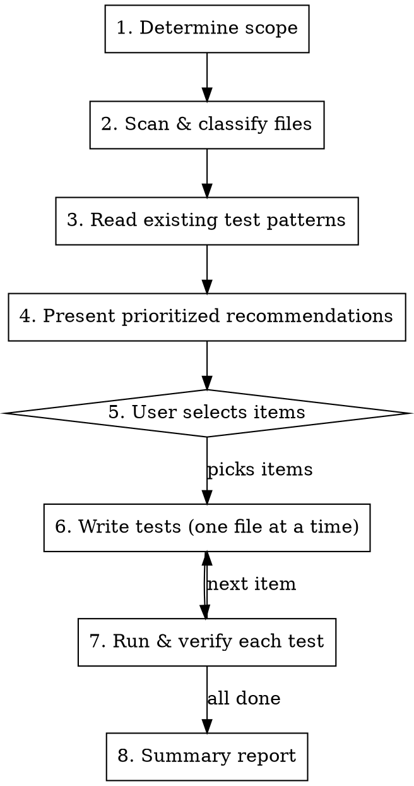

# Test Audit

## Overview

Analyzes the codebase to identify files that need tests, prioritizes them by impact, and writes the tests. Follows a testing trophy philosophy: integration tests are the bulk, unit tests for pure logic, E2E for critical paths only.

## When to trigger

- User says "test audit", "what needs testing", "add tests", "test coverage"
- After completing a feature (proactively suggest)
- User asks "what should I test next"

## Testing Philosophy

**Priority order (testing trophy):**

1. **Integration tests (~60-70% of effort)** — components rendered with hooks, mocked API, user interaction via RTL. Hooks tested via `renderHook` with mocked dependencies. Highest confidence-to-cost ratio.
2. **Unit tests (~15-20%)** — pure functions with branching logic: utils, formatters, calculations, state derivations. Fast, cheap, stable.
3. **E2E tests (~10-15%)** — critical user journeys only: login, core navigation, completing a CBT tool. Flag for Maestro, don't write Jest tests for these.

**What NOT to test:**
- Framework behavior (does `useState` work?)
- Simple pass-through components with no conditional logic
- Files under 10 lines with no branching
- Pure type/interface files, config/constant exports with no logic
- Re-export index files
- Implementation details (internal state, method calls)

## Workflow



## Step-by-step

### 1. Determine scope

Check if the user specified a scope (e.g., "test the hooks", "test utils/"). If not, check for recently changed files:

```bash
# Files changed vs main (feature branch work)
git diff --name-only main...HEAD -- '*.ts' '*.tsx' ':!*.test.*' ':!*.spec.*'

# If on main or no diff, check recent commits
git diff --name-only HEAD~10 -- '*.ts' '*.tsx' ':!*.test.*' ':!*.spec.*'
```

**Scope priority:**
1. User-specified scope (e.g., "hooks/", "utils/severity.ts")
2. Files changed on current branch vs main
3. Full codebase scan (if no recent changes or user asks for full audit)

### 2. Scan & classify files

For each source file in scope, classify it:

| Category | Test Type | Criteria |
|----------|-----------|----------|
| **Must test — Unit** | Unit | Pure functions with branching logic, no React, no side effects. Files in `utils/`, helper functions, formatters, calculations. |
| **Must test — Integration** | Integration | Components with conditional rendering, variants, user interaction, or state. Hooks that fetch data or manage complex state. Zustand stores. |
| **E2E candidate** | Maestro | Multi-screen flows, navigation, auth. Flag but don't write Jest tests. |
| **Skip** | None | Pass-through components, config files, constants, type files, re-exports, files <10 lines with no branches. |

**Classification logic per directory:**

- `utils/*.ts` — Unit test candidates. Check for exported functions with `if`/`switch`/ternary/`??` logic.
- `hooks/*.ts` — Integration test candidates. Data-fetching hooks (useQuery/useMutation wrappers) and stateful hooks.
- `stores/*.ts` — Integration test candidates. Test state transitions and actions.
- `components/**/*.tsx` — Integration test candidates IF they have: conditional rendering, multiple variants/props that change output, user interaction handlers, or non-trivial state. Skip if they just compose other components with static props.
- `app/**/*.tsx` — Generally E2E candidates (screen-level). Only write Jest tests for screens with significant inline logic.

**Auto-skip rules:**
- File already has a colocated `.test.ts(x)` or `.spec.ts(x)` file
- File is under 10 lines with no branching logic
- File only exports types, interfaces, or constants
- File is an index re-export

### 3. Read existing test patterns

Read all existing test files to extract the project's established patterns:

```bash
# Find all test files
find . -name '*.test.ts' -o -name '*.test.tsx' | grep -v node_modules
```

Read each test file and note:
- `describe`/`it` naming conventions
- How mocks are set up (jest.mock paths, mock factories)
- How RTL queries are used (screen.getByText, screen.getByTestId)
- How timers are handled (jest.useFakeTimers pattern)
- How styles are asserted (expect.arrayContaining pattern for RN)
- Import style (@/ path alias)

**Baseline patterns to follow (even if no existing tests cover the case):**

#### Unit tests (utils, helpers)
```typescript
import { functionName } from './fileName';

describe('functionName', () => {
  it('describes the expected behavior', () => {
    const result = functionName(input);
    expect(result).toBe(expected);
  });
});
```

#### Component integration tests
```typescript
import { render, screen, fireEvent } from '@testing-library/react-native';
import { ComponentName } from './ComponentName';

describe('ComponentName', () => {
  it('renders with default props', () => {
    render(<ComponentName requiredProp="value" />);
    expect(screen.getByText('Expected text')).toBeTruthy();
  });

  it('responds to user interaction', () => {
    const onPress = jest.fn();
    render(<ComponentName onPress={onPress} />);
    fireEvent.press(screen.getByText('Button'));
    expect(onPress).toHaveBeenCalled();
  });
});
```

#### Hook integration tests
```typescript
import { renderHook, waitFor } from '@testing-library/react-native';
import { useHookName } from './useHookName';
import { createQueryClientWrapper } from '@/test-utils';

// Mock API layer
jest.mock('@/api/api', () => ({
  api: {
    get: jest.fn(),
    post: jest.fn(),
  },
}));

describe('useHookName', () => {
  it('returns data on success', async () => {
    (api.get as jest.Mock).mockResolvedValueOnce({ data: mockData });
    const { result } = renderHook(() => useHookName(), {
      wrapper: createQueryClientWrapper(),
    });
    await waitFor(() => expect(result.current.data).toEqual(mockData));
  });
});
```

#### Zustand store tests
```typescript
import { useAuthStore } from './authStore';

describe('authStore', () => {
  beforeEach(() => {
    useAuthStore.setState(useAuthStore.getInitialState());
  });

  it('sets user on login', () => {
    useAuthStore.getState().setUser(mockUser);
    expect(useAuthStore.getState().user).toEqual(mockUser);
  });
});
```

### 4. Present prioritized recommendations

Output a table grouped by category, sorted by priority:

```markdown
## Test Audit Results

### Recently changed (highest priority)
| # | File | Test Type | Rationale |
|---|------|-----------|-----------|
| 1 | `utils/severity.ts` | Unit | Pure logic — severity level mapping with branching |
| 2 | `hooks/useAuth.ts` | Integration | Auth state + API interaction |

### Must test
| # | File | Test Type | Rationale |
|---|------|-----------|-----------|
| 3 | `stores/authStore.ts` | Integration | Zustand store — state transitions, persistence |
| 4 | `components/ActionMenu.tsx` | Integration | Variants, destructive confirmation, user interaction |

### E2E candidates (Maestro)
| File | Suggested flow |
|------|---------------|
| Patient attempt submission | `flows/attempts/submit-attempt.yaml` |

### Skipped (with reason)
| File | Reason |
|------|--------|
| `types/types.ts` | Type-only file |
| `components/Container.tsx` | Pass-through layout wrapper |
```

Then ask: **"Which items should I write tests for? You can say 'all', 'top 5', 'utils only', or pick by number."**

### 5. User selects items

Wait for the user to choose. Accept:
- "all" — write all recommended tests
- "top N" — write the first N items
- Category name — "utils", "hooks", "components", "stores"
- Specific numbers — "1, 3, 5"
- A specific file — "just severity.ts"

### 6. Write tests (one file at a time)

For each approved item:

1. **Read the source file** completely
2. **Read existing test files** for pattern reference (if not already loaded)
3. **Identify what to test:**
   - All exported functions/components
   - Each branch/variant/conditional path
   - Edge cases (null, empty, error states)
   - User interactions (for components)
4. **Write the test file** colocated next to the source (`FileName.test.ts(x)`)
5. **Follow project conventions:**
   - `import type` for type-only imports
   - `@/` path alias for imports
   - `describe`/`it` structure matching existing tests
   - `expect.arrayContaining([expect.objectContaining(...)])` for RN style assertions
   - `jest.useFakeTimers()` + `jest.setSystemTime()` for time-dependent logic — always restore via `afterEach(() => jest.useRealTimers())`, not inline cleanup
   - Wrap dev-only logging assertions in `__DEV__` checks
   - Test behavior, not implementation — query by text/testID, not internal state
   - Use `createQueryClientWrapper()` from `test-utils/` for hook tests that need a `QueryClientProvider` — don't create inline wrappers
   - Use `mockQueryResult()` from `test-utils/` to build mock `UseQueryResult` objects
   - Global mocks (AsyncStorage, etc.) live in `jest.setup.ts` — add new global mocks there, not per-file
   - **Never use `as` type casts in test data** — use mock factories (see below) that return real types with sensible defaults. Casts hide mismatches between test data and the actual API contract; if the type doesn't fit, fix the data, not the type
   - **Use mock factories for complex shared types** — add factory functions to `test-utils/factories.ts` that return fully typed objects with sensible defaults, accepting `Partial<T>` overrides. Tests should only specify the fields they care about, not build 40-line mock objects. Example:
     ```typescript
     // test-utils/factories.ts
     import type { Patient } from '@milobedini/shared-types';

     export const makePatient = (overrides?: Partial<Patient>): Patient => ({
       _id: 'patient-1',
       firstName: 'Test',
       lastName: 'User',
       email: 'test@example.com',
       role: 'patient',
       ...overrides,
     });

     // in a test — focused and type-safe
     const patient = makePatient({ firstName: 'Alice' });
     ```

### 7. Run & verify each test

After writing each test file:

```bash
npx jest <test-file-path> --no-coverage
```

- If tests **pass**: mark as done, move to next item
- If tests **fail**: read the error, fix the test (not the source code), re-run
- If a test fails because the source code has a bug: report it to the user, skip that test case, add a `// TODO: source bug — [description]` comment
- Max 3 fix attempts per test file before flagging to user

### 8. Summary report

After all tests are written:

```markdown
## Test Audit Complete

### Written
| File | Tests | Status |
|------|-------|--------|
| `utils/severity.test.ts` | 6 | Passing |
| `hooks/useAuth.test.ts` | 4 | Passing |

### Skipped / Flagged
| File | Reason |
|------|--------|
| `hooks/usePatientDashboard.ts` | Source bug: returns undefined when no patient ID |

### Coverage impact
- Before: X test files
- After: Y test files
- New test cases: Z

### Suggested next steps
- [Any E2E flows that should be added]
- [Any source bugs discovered]
```

## Edge cases

- **No files need testing:** Report "all files in scope are either tested or below the testing threshold" — don't write tests for the sake of it.
- **Source file has external dependencies that are hard to mock:** Use `jest.mock()` at the module level. For Expo/RN native modules, add to `transformIgnorePatterns` or create a manual mock in `__mocks__/`.
- **Component requires providers (QueryClient, Paper, etc.):** Use `createQueryClientWrapper()` from `test-utils/`. If a new shared wrapper is needed, add it to `test-utils/` rather than creating per-file utilities.
- **Hook uses navigation (expo-router):** Mock `expo-router` with `jest.mock('expo-router', () => ({ useRouter: jest.fn(), useLocalSearchParams: jest.fn() }))`.
- **File was recently refactored:** Re-read the source — don't rely on stale knowledge from the scan phase.
- **User asks to test a file the skill classified as "skip":** Write the test anyway — user judgment overrides the heuristic. Note in the output that the file was below the normal threshold.
