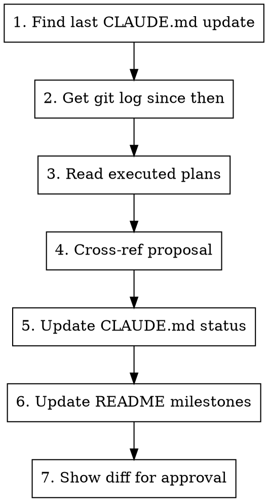

# Update Status

## Overview

Updates the **"Current build status"** section of `CLAUDE.md` and the **"Recent Milestones"** section of `README.md` to reflect what has actually been built since the last update.

## Workflow



## Step-by-step

### 1. Determine the diff window

Run:
```bash
git log -1 --format="%H %ai" -- CLAUDE.md
```

This gives the commit hash and date of the last CLAUDE.md update. All changes since that hash are in scope.

### 2. Gather what changed

Run in parallel:
```bash
# All commits since last CLAUDE.md update
git log <hash>..HEAD --oneline

# Detailed diff to understand what was built
git log <hash>..HEAD --stat
```

### 3. Read executed plans

Check `docs/superpowers/plans/` for any plan files dated after the last CLAUDE.md update. These contain structured descriptions of what was built and are the most reliable source of truth for feature completions.

### 4. Cross-reference with the proposal

Read the current CLAUDE.md "Not yet built" list and compare against what the git history and plans show was completed. The product vision in CLAUDE.md (sourced from `docs/proposal.pdf`) defines the target — use it to understand what "done" means for each item.

### 5. Update CLAUDE.md — build status only

Edit **only** these three sub-sections under `### Current build status`:

- **Done:** — Move items here from "In progress" or "Not yet built" when fully implemented. Use the same concise format as existing entries (feature name + parenthetical summary of what's included).
- **In progress / partial:** — Add or update items that are partially built. Include what exists and what's missing.
- **Not yet built:** — Remove items that moved to Done or In progress.

**Do NOT touch** any other section of CLAUDE.md (Stack, Architecture, Code Conventions, etc.). Those are updated deliberately by the user, not auto-synced.

### 6. Update README — recent milestones

Add or update a `## Recent Milestones` section in `README.md`, placed **after the Features section and before the Tech Stack section**.

Format:
```markdown
## Recent Milestones

- **Activity Diary enhancements** — full weekly grid, mastery/pleasure scales, reflection prompts (2026-03-18)
- **UI/UX polish pass** — spacing, typography, chip styling, layout fixes (2026-03-18)
```

Rules:
- Keep to the **last 10 milestones max** — drop oldest when adding new
- Each entry: bold feature name, em dash, one-line summary, date in parentheses
- Date = the merge/completion date from git history
- Group related commits into single milestones (don't list individual commits)

### 7. Show diff for approval

After editing both files, show the user a summary of what changed:
- Items moved between status categories
- New milestones added to README
- Any items you were unsure about (flag for user decision)

**Do not commit.** Let the user review and decide.

## What NOT to update

- Architecture section — only changed when deliberate design decisions are made
- Code Conventions — only changed when new conventions are adopted
- Stack — only changed when dependencies change
- Git Workflow, Commands, Validation — stable sections

## Edge cases

- **No changes since last update:** Tell the user everything is current. Don't make empty edits.
- **Ambiguous completion:** If a feature seems partially done but you're not sure, keep it in "In progress" and flag it for the user.
- **Backend-only changes:** If commits are in the backend repo (`../cbt/`), note them but don't update frontend build status — this skill tracks the frontend app.
