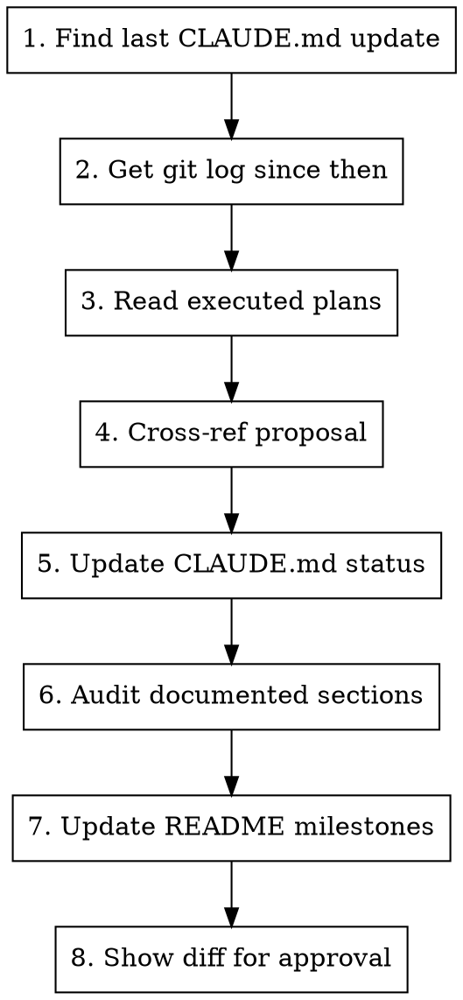

# Update Status

## Overview

Updates the **"Current build status"** section of `CLAUDE.md`, the **"Recent Milestones"** section of `README.md`, and **audits all other documented sections** (Architecture, Stack, README Architecture, etc.) against the actual codebase to catch drift.

## Workflow



## Step-by-step

### 1. Determine the diff window

Run:
```bash
git log -1 --format="%H %ai" -- CLAUDE.md
```

This gives the commit hash and date of the last CLAUDE.md update. All changes since that hash are in scope.

### 2. Gather what changed

Run in parallel:
```bash
# All commits since last CLAUDE.md update
git log <hash>..HEAD --oneline

# Detailed diff to understand what was built
git log <hash>..HEAD --stat
```

### 3. Read executed plans

Check `docs/superpowers/plans/` for any plan files dated after the last CLAUDE.md update. These contain structured descriptions of what was built and are the most reliable source of truth for feature completions.

### 4. Cross-reference with the proposal

Read the current CLAUDE.md "Not yet built" list and compare against what the git history and plans show was completed. The product vision in CLAUDE.md (sourced from `docs/proposal.pdf`) defines the target — use it to understand what "done" means for each item.

### 5. Update CLAUDE.md — build status

Edit these three sub-sections under `### Current build status`:

- **Done:** — Move items here from "In progress" or "Not yet built" when fully implemented. Use the same concise format as existing entries (feature name + parenthetical summary of what's included).
- **In progress / partial:** — Add or update items that are partially built. Include what exists and what's missing.
- **Not yet built:** — Remove items that moved to Done or In progress.

### 6. Audit documented sections against the codebase

This step catches drift in sections that describe *how things work*, not *what's been built*. For each section below, read the relevant source files and verify the documentation is still accurate.

#### CLAUDE.md sections to audit

| Section | Verify against |
|---------|---------------|
| **Architecture** | `app/_layout.tsx` (QueryClient config), `api/api.ts` (interceptors), `app/(main)/_layout.tsx` (route guards), `components/attempts/presenters/` (presenter pattern) |
| **Stack** | `package.json` dependencies — check versions and that all listed libraries are still used |
| **Code Conventions** | Spot-check recent files for any new conventions adopted but not documented |
| **Commands** | `package.json` scripts — check all listed commands still work |

#### README sections to audit

| Section | Verify against |
|---------|---------------|
| **Architecture** | Must match CLAUDE.md Architecture (single source of truth) — rewrite README's Architecture to be a concise mirror of CLAUDE.md's |
| **Tech Stack** | Must match CLAUDE.md Stack |
| **Project Structure** | Run `ls` on `app/`, `components/`, `hooks/` — check for new top-level directories or renamed folders |
| **Features** | Should reflect current Done list from CLAUDE.md build status |
| **Scripts** | Must match CLAUDE.md Commands |

#### How to audit

1. **Read the source files** listed in the table above (use parallel reads where possible)
2. **Compare** what the code actually does vs what the docs say
3. **Fix** any inaccuracies directly — update the wording to match reality
4. **Flag** anything ambiguous for the user rather than guessing

Common drift patterns to watch for:
- Query/cache config changes (staleTime, refetch behaviour) not reflected in Architecture
- New dependencies added but not listed in Stack
- New app routes or directories not in Project Structure
- Removed or renamed scripts not updated in Commands

### 7. Update README — recent milestones

Add or update a `## Recent Milestones` section in `README.md`, placed **after the Features section and before the Tech Stack section**.

Format:
```markdown
## Recent Milestones

- **Activity Diary enhancements** — full weekly grid, mastery/pleasure scales, reflection prompts (2026-03-18)
- **UI/UX polish pass** — spacing, typography, chip styling, layout fixes (2026-03-18)
```

Rules:
- Keep to the **last 10 milestones max** — drop oldest when adding new
- Each entry: bold feature name, em dash, one-line summary, date in parentheses
- Date = the merge/completion date from git history
- Group related commits into single milestones (don't list individual commits)

### 8. Show diff for approval

After editing all files, show the user a summary of what changed:
- Items moved between status categories
- Documentation corrections from the audit (list each fix with before → after)
- New milestones added to README
- Any items you were unsure about (flag for user decision)

**Do not commit.** Let the user review and decide.

## Edge cases

- **No changes since last update:** Still run the audit (step 6) — documentation can drift even without new features. Only skip if user explicitly says "just milestones".
- **Ambiguous completion:** If a feature seems partially done but you're not sure, keep it in "In progress" and flag it for the user.
- **Backend-only changes:** If commits are in the backend repo (`../cbt/`), note them but don't update frontend build status — this skill tracks the frontend app.
- **Audit finds nothing wrong:** Report "all sections verified, no drift found" — don't make cosmetic edits.
