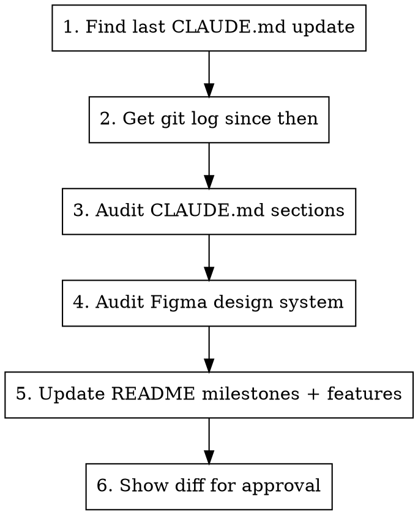

# Update Status

## Overview

**Audits all documented sections** (Architecture, Stack, Commands, etc.) in `CLAUDE.md` and `README.md` against the actual codebase to catch drift, **syncs the Figma design system rules** (`.claude/rules/figma-design-system.md`) with the current codebase, and **updates README milestones**.

Build status is tracked in PM briefs (`docs/pm/`) and `README.md` — not in `CLAUDE.md`.

## Workflow



## Step-by-step

### 1. Determine the diff window

Run:
```bash
git log -1 --format="%H %ai" -- CLAUDE.md
```

This gives the commit hash and date of the last CLAUDE.md update. All changes since that hash are in scope.

### 2. Gather what changed

Run in parallel:
```bash
# All commits since last CLAUDE.md update
git log <hash>..HEAD --oneline

# Detailed diff to understand what was built
git log <hash>..HEAD --stat
```

Also check `docs/superpowers/plans/` for any plan files dated after the last CLAUDE.md update — these contain structured descriptions of what was built.

### 3. Audit CLAUDE.md sections against the codebase

This step catches drift in sections that describe *how things work*. For each section below, read the relevant source files and verify the documentation is still accurate.

| Section | Verify against |
|---------|---------------|
| **Architecture** | `app/_layout.tsx` (QueryClient config), `api/api.ts` (interceptors), `app/(main)/_layout.tsx` (route guards), `components/attempts/presenters/` (presenter pattern) |
| **Stack** | `package.json` dependencies — check versions and that all listed libraries are still used |
| **Patterns** | Verify data-fetching patterns still match actual hook implementations |
| **Code Conventions** | Spot-check recent files for any new conventions adopted but not documented |
| **Commands** | `package.json` scripts — check all listed commands still work |

#### How to audit

1. **Read the source files** listed in the table above (use parallel reads where possible)
2. **Compare** what the code actually does vs what the docs say
3. **Fix** any inaccuracies directly — update the wording to match reality
4. **Flag** anything ambiguous for the user rather than guessing

Common drift patterns to watch for:
- Query/cache config changes (staleTime, refetch behaviour) not reflected in Architecture
- New dependencies added but not listed in Stack
- New app routes or directories not in Project Structure
- Removed or renamed scripts not updated in Commands

### 4. Audit Figma design system rules

Audit `.claude/rules/figma-design-system.md` against the actual codebase to catch drift. This file is loaded as context for every Figma implementation task, so stale information directly causes incorrect code generation.

#### What to verify

| Section | Verify against |
|---------|---------------|
| **Color Tokens** | `constants/Colors.ts` and `tailwind.config.js` — check all tokens listed still exist with the correct values, and add any new tokens that have been introduced |
| **Typography** | `components/ThemedText.tsx` — check all `type` variants match (font, size, use-case). Add new types, remove deleted ones |
| **Component Organization** | `components/ui/` — check the reusable component list is complete. Add new UI primitives, remove deleted ones |
| **Icon System** | `package.json` — verify listed icon packages are still the ones installed |
| **Button Hierarchy** | `components/ui/ThemedButton.tsx` — check variant names and descriptions match |
| **Layout Patterns** | `components/Container.tsx`, `components/ContentContainer.tsx` — verify defaults (className, padding) |
| **Paper Theme** | `app/_layout.tsx` — verify theme config (colors, surface tokens) |
| **Status chip color pairs** | `constants/Colors.ts` — verify all chip color pairs listed still exist and values are correct |

#### How to audit

1. **Read the source files** listed above (use parallel reads where possible)
2. **Compare** what the code defines vs what the design system doc says
3. **Fix** any inaccuracies — update values, add missing tokens, remove stale entries
4. **Do not change** the Figma MCP Integration Flow, Import Conventions, Asset Handling, or Project-Specific Conventions sections unless they are factually wrong — these are workflow guidance, not derived from code

Common drift patterns:
- New color tokens added to `Colors.ts` / `tailwind.config.js` but not listed in the doc
- ThemedText types added/renamed but not reflected in the typography table
- New UI components created in `components/ui/` but not listed in Component Organization
- ThemedButton variants added/changed but not in Button Hierarchy
- Chip color pairs added or renamed

### 5. Update README

#### Recent milestones

Add or update a `## Recent Milestones` section in `README.md`, placed **after the Features section and before the Tech Stack section**.

Format:
```markdown
## Recent Milestones

- **Activity Diary enhancements** — full weekly grid, mastery/pleasure scales, reflection prompts (2026-03-18)
- **UI/UX polish pass** — spacing, typography, chip styling, layout fixes (2026-03-18)
```

Rules:
- Keep to the **last 10 milestones max** — drop oldest when adding new
- Each entry: bold feature name, em dash, one-line summary, date in parentheses
- Date = the merge/completion date from git history
- Group related commits into single milestones (don't list individual commits)

#### Other README sections to audit

| Section | Verify against |
|---------|---------------|
| **Architecture** | Must match CLAUDE.md Architecture (single source of truth) — rewrite README's Architecture to be a concise mirror of CLAUDE.md's |
| **Tech Stack** | Must match CLAUDE.md Stack |
| **Project Structure** | Run `ls` on `app/`, `components/`, `hooks/` — check for new top-level directories or renamed folders |
| **Features** | Should reflect what's actually built — cross-reference git history and PM briefs in `docs/pm/` |
| **Scripts** | Must match CLAUDE.md Commands |

### 6. Show diff for approval

After editing all files, show the user a summary of what changed:
- Documentation corrections from the audit (list each fix with before → after)
- Figma design system updates (new/changed/removed tokens, components, types)
- New milestones added to README
- Any items you were unsure about (flag for user decision)

**Do not commit.** Let the user review and decide.

## Edge cases

- **No changes since last update:** Still run the audits (steps 3–4) — documentation can drift even without new features. Only skip if user explicitly says "just milestones".
- **Backend-only changes:** If commits are in the backend repo (`../cbt/`), note them but don't update frontend build status — this skill tracks the frontend app.
- **Audit finds nothing wrong:** Report "all sections verified, no drift found" — don't make cosmetic edits.
