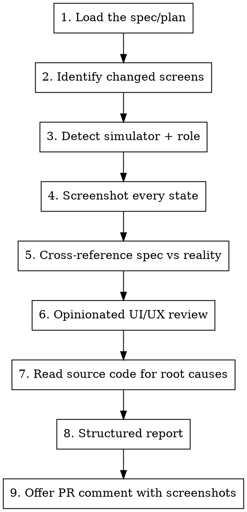

# Visual Test

## Overview

Performs an opinionated UI/UX review by screenshotting every meaningful state of affected screens, cross-referencing against the feature spec/plan, and flagging anything that doesn't meet high visual and interaction standards. Offers to post findings as a PR comment with screenshots.

Uses Maestro only as a navigation tool (temporary scripts to reach screen states) — does NOT create or commit persistent E2E test flows.

## When to trigger

- User says "visual test", "screenshot test", "check the UI"
- **Proactively offer** after completing feature development from a superpowers plan
- Before pushing to git or creating a PR when UI has changed
- After any work that touched screens, components, colours, or layouts

## Prerequisites

Before starting, verify all three are running:
1. **iOS simulator** — `xcrun simctl list devices booted` should show a device
2. **Expo dev server** — `npx expo start` running in the project (on the correct branch)
3. **Backend** — `../cbt/` server running

If any are missing, tell the user and stop. If the Expo server is running on the wrong branch, warn the user.

## Workflow



## Step-by-step

### 1. Load the spec/plan

Check for the feature's superpowers plan or spec:

```bash
ls docs/superpowers/plans/ docs/superpowers/specs/ 2>/dev/null
```

Read any plan/spec files related to the current branch or PR. These define **what was intended** — the visual test compares intent against reality. If no plan exists, use the PR description or ask the user what the feature should do.

Key things to extract from the plan:
- What screens/components were being built or modified
- What interactions were specified (search, filter, sort, etc.)
- What states were described (empty, loading, error, filtered, etc.)
- Any specific design decisions or UX requirements

### 2. Identify changed screens

```bash
git diff --name-only main...HEAD
```

Map changed files to screens:
- `app/(main)/(tabs)/<tab>/` → that tab screen
- `app/(auth)/` → auth screens (limited testability — bottom sheet issue)
- `app/(welcome)/` → onboarding screens
- `components/<feature>/` → grep for which screens import them
- `constants/Colors.ts`, `constants/Typography.ts` → all screens potentially affected
- `hooks/` → grep for which screens import them
- `components/ui/` → shared components, screenshot broadly

### 3. Detect simulator + role

```bash
# Get device ID
xcrun simctl list devices booted | grep -o '[A-F0-9-]\{36\}'

# Detect logged-in role
maestro hierarchy 2>&1 | grep 'accessibilityText' | grep -v '""' | sed 's/.*: *"//' | sed 's/".*//' | sort -u
```

Role detection:
- "All Users, tab" visible → Admin
- "Your clients" visible → Therapist
- "Active attempts" visible → Patient

If the wrong role is logged in for the screens being tested, tell the user to switch.

### 4. Screenshot every state

Use temporary Maestro scripts (written to `/tmp/`, never committed) to navigate to each state and capture screenshots.

```bash
mkdir -p /tmp/visual-test
```

**Navigation script pattern** — write to `/tmp/nav-*.yaml`, run, screenshot, delete:
```yaml
appId: host.exp.Exponent
---
- tapOn:
    text: ".*Target Tab, tab.*"
- waitForAnimationToEnd
```

```bash
maestro test /tmp/nav-to-state.yaml
xcrun simctl io <DEVICE_ID> screenshot /tmp/visual-test/<NN>-<screen>-<state>.png
```

**Number screenshots sequentially** (`01-`, `02-`, etc.) for ordering in the report.

**Read every screenshot immediately** using the Read tool — don't batch them.

#### Maestro navigation tips
- Tab items: `".*Home, tab.*"` (regex)
- `waitForAnimationToEnd` after every navigation tap
- `maestro hierarchy` to discover selectors before writing scripts
- Back button: `tapOn: { id: "BackButton" }`
- Text selectors match `accessibilityLabel`, `accessibilityText`, or visible text
- Allow 1s sleep after debounced inputs before screenshotting

#### States to capture

For each affected screen, screenshot **every** state that a user would encounter:

| State | When to capture |
|-------|----------------|
| Default/loaded | Always |
| Empty | If reachable (no data, no results) |
| Search active | If screen has search — with text typed AND visible |
| Search no results | If possible — query that returns nothing |
| Filter drawer/modal open | If screen has filters |
| Filters applied (results) | After applying a filter, showing filtered list |
| Sort menu open | If screen has sort |
| Sort applied | Different from default sort |
| Scrolled | If content overflows the viewport |
| Loading/skeleton | During data fetch if capturable |
| Error | If triggerable |
| Keyboard open | If screen has text input |

### 5. Cross-reference spec vs reality

Compare each screenshot against the plan/spec:

- **Missing features:** Was something specified in the plan but not visible on screen?
- **Extra features:** Was something added that wasn't in the plan? (may be fine, but note it)
- **Behavioural differences:** Does the interaction work as specified? (e.g., plan says "debounced search with loading indicator" but no indicator is visible)
- **State coverage:** Did the plan describe states (empty, error, loading) that aren't implemented?

### 6. Opinionated UI/UX review

**Be harsh. Be picky. Flag everything.** A review that says "looks good" is worthless — find problems. Every screen has something that could be better.

#### Visual design

| Check | What to look for |
|-------|-----------------|
| **Text visibility** | Is ALL text readable? Input text, placeholder text, disabled text, secondary text. Invisible or near-invisible text is a **blocker**. Check input fields especially — typed text must be clearly visible against the input background. |
| **Colour usage** | Do colours match `Colors` constants? (`#0c1527` background, `#18cdba` accent). Any hardcoded hex values in the source? |
| **Contrast** | WCAG AA minimum. Check especially: text on dark backgrounds, disabled states, chip text on chip backgrounds, input text on input backgrounds. |
| **Spacing** | Consistent with the app's spacing scale? Cramped or overly loose areas? |
| **Alignment** | Elements on the same row properly aligned (baseline, center)? |
| **Typography** | Clear size/weight hierarchy — headings, body, labels, metadata should be visually distinct. |
| **Dividers/borders** | Subtle, consistent, not too heavy, not missing where expected. |

#### UX behaviour

| Check | What to look for |
|-------|-----------------|
| **Loading feedback** | Loading indicator during data fetches. Must be **scoped to the content area that's changing** — a full-screen loader for a filter/search change is wrong. Header and controls should remain stable. |
| **Screen stability** | When search/filter/sort triggers a re-fetch, does the entire screen flash/re-render? Only the results area should update. Header, search bar, and controls must remain visually stable. Full-screen re-renders = **issue**. |
| **Input feedback** | When typing in search, is there visual feedback that a query is pending? No feedback = user doesn't know their input registered. |
| **Filter state clarity** | When filters are active, is it immediately obvious WITHOUT opening the drawer? Badge, colour change, text indicator? |
| **Sort state clarity** | Current sort clearly indicated? Accessible to colour-blind users (not colour-only)? |
| **Empty states** | When search/filter returns no results — helpful message or just blank space? |
| **Touch targets** | Minimum 44pt for all interactive elements. Check small chips, close buttons, icons. |
| **Scroll behaviour** | Scrollable if content overflows? Tab bar accessible? Content hidden behind tab bar? |
| **Keyboard behaviour** | Input focused → keyboard pushes content up appropriately? Keyboard dismissible? |
| **State persistence** | Navigate away and back — are filters/search/sort preserved? |
| **Overlay/backdrop** | Dropdowns, drawers, menus — do they have proper backdrops? Can you tell the overlay from the content beneath? |

#### Consistency

| Check | What to look for |
|-------|-----------------|
| **Cross-screen** | Does this screen match the visual style of other screens in the app? |
| **Component reuse** | Buttons, chips, inputs styled identically to elsewhere? |
| **Animation** | Drawers, menus, transitions match the app's existing motion style? |
| **Semantic colour** | Destructive actions red, neutral actions grey, primary actions accent-coloured? Cancel buttons should NOT be red. |

#### Root cause investigation

When you find a visual issue, **read the source code** to identify the root cause. Don't just say "text is invisible" — explain WHY (e.g., "textColor is `#e0e9f3` but the Paper TextInput has a default light background because no dark theme is applied"). This makes the report actionable.

```bash
# Read the screen component
# Check Colors constants
# Check if Paper theme is applied
# Verify style props on the component
```

#### Severity levels

- **Blocker** — Broken functionality, unreadable text, inaccessible controls. Must fix before merge.
- **Issue** — UX problems, missing loading states, inconsistent behaviour, poor interaction feedback. Should fix before merge.
- **Nit** — Minor polish, spacing tweaks. Can fix later.

**Bias toward Blocker and Issue.** When unsure between Nit and Issue, call it an Issue.

### 7. Structured report

```markdown
## Visual Test Results

### Spec Compliance
[What matches the plan, what's missing, what was added]

### Screen Reviews

#### [Screen Name] — [State]
**Screenshot:** `/tmp/visual-test/<filename>.png`

**Blockers:**
- [description + root cause from source code]

**Issues:**
- [description + root cause]

**Nits:**
- [description]

### Summary
[2-3 sentences. Direct verdict: ready to merge or not. List the blockers/issues that must be fixed.]
```

### 8. Offer PR comment

After presenting the report, **always ask:** "Want me to post this as a PR comment?"

If the user accepts, post a text-only review comment (no images — avoids polluting the repo with screenshot files):

```bash
gh pr comment <PR_NUMBER> --body "$(cat <<'EOF'
## Visual Test Review

Cross-referenced against [spec](<path>) and [plan](<path>).

### Findings

#### Blockers
- [description + root cause]

#### Issues
- [numbered list with root causes]

#### Nits
- [list]

### Spec Compliance
[What matches, what's missing]

### Verdict
[Ready to merge / Needs fixes]
EOF
)"
```

Screenshots remain in `/tmp/visual-test/` for local reference. The user can manually drag images into the PR comment on GitHub if they want visual evidence attached.

## Known Limitations

- **Bottom sheet content** (`@gorhom/bottom-sheet`) is invisible to Maestro — cannot navigate into or screenshot bottom sheet forms
- **Moti animations** from `opacity: 0` are excluded from the accessibility tree until complete
- **Role switching** requires manual login — cannot automate due to bottom sheet limitation
- Screenshots capture the full simulator frame including status bar
