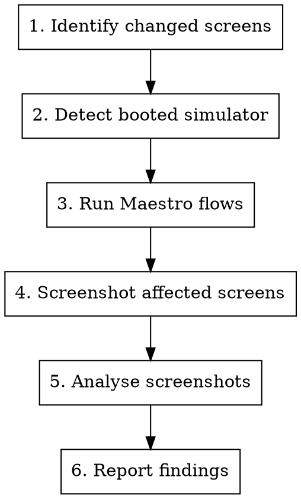

# Visual Test

## Overview

Takes screenshots of affected screens, runs Maestro flows, and provides UI/UX feedback on changes. Requires an iOS simulator running with the Expo dev server and backend active.

## Prerequisites

Before starting, verify all three are running:
1. **iOS simulator** — `xcrun simctl list devices booted` should show a device
2. **Expo dev server** — `npx expo start` running in the project
3. **Backend** — `../cbt/` server running

If any are missing, tell the user and stop.

## Workflow



## Step-by-step

### 1. Identify changed screens

Determine which screens are affected by the current changes:

```bash
# Get changed files vs base branch
git diff --name-only main...HEAD

# Or if working on main, unstaged/staged changes
git diff --name-only HEAD
```

Map changed files to screens using these rules:
- `app/(main)/(tabs)/<tab>/` → that tab screen
- `app/(auth)/` → auth screens (limited testability — bottom sheet issue)
- `app/(welcome)/` → onboarding screens
- `components/<feature>/` → find which screens import them via grep
- `constants/Colors.ts`, `constants/Typography.ts` → all screens potentially affected
- `hooks/` → find which screens import them
- `components/ui/` → shared components, screenshot broadly

### 2. Detect booted simulator

```bash
# Get the booted device ID
xcrun simctl list devices booted | grep -o '[A-F0-9-]\{36\}'
```

Store this device ID — needed for screenshots. If no device is booted, tell the user.

### 3. Run Maestro flows

Determine the current logged-in role by checking the hierarchy:

```bash
maestro hierarchy 2>&1 | grep 'accessibilityText' | grep -v '""' | sed 's/.*: *"//' | sed 's/".*//' | sort -u
```

Role detection:
- "All Users, tab" visible → Admin
- "Your clients" and "All patients" visible → Therapist
- "Active attempts" visible → Patient

Run the matching role suite:

```bash
maestro test .maestro/<role>/
```

If any flow fails, report the failure with the debug screenshot path from Maestro's output.

### 4. Screenshot affected screens

Navigate to each affected screen and capture:

```bash
# Navigate via Maestro (example: tap a tab)
maestro test /tmp/nav-to-screen.yaml

# Capture screenshot
xcrun simctl io <DEVICE_ID> screenshot /tmp/visual-test/<screen-name>.png
```

Screenshot naming: `/tmp/visual-test/<screen-name>.png`

For each affected screen:
1. Write a minimal Maestro flow to navigate there
2. Wait for animations to settle
3. Take the screenshot
4. Navigate back or to the next screen

Always create the output directory first: `mkdir -p /tmp/visual-test`

### 5. Analyse screenshots

Read each screenshot using the Read tool. For each, evaluate:

**Layout & spacing:**
- Are elements properly aligned?
- Is spacing consistent with the app's spacing scale?
- Does content overflow or get clipped?

**Visual hierarchy:**
- Is the most important content prominent?
- Do headings, body text, and labels have clear size/weight distinction?
- Are interactive elements visually distinct from static content?

**Colour & contrast:**
- Do colours match the `Colors` constants (dark theme: `#0c1527` background, `#18cdba` accent)?
- Is text readable against its background?
- Do disabled/active states have clear visual difference?

**Consistency:**
- Does the screen match the style of other screens in the app?
- Are buttons, chips, and inputs styled consistently?

**Mobile UX:**
- Is touch target size adequate (min 44pt)?
- Is the screen scrollable if content overflows?
- Does the tab bar remain accessible?

### 6. Report findings

Present a structured report:

```markdown
## Visual Test Results

### Maestro Flows
- ✅ therapist/home — passed
- ✅ therapist/tab-navigation — passed
- ❌ therapist/clients-navigation — FAILED (element not found: "Your clients")

### Screen Reviews

#### [Screen Name]
**Screenshot:** /tmp/visual-test/screen-name.png
- ✅ Layout and spacing look correct
- ⚠️ Button contrast could be improved on disabled state
- ❌ Text overflows container on smaller text

### Summary
[1-2 sentence overall assessment]
```

## Known Limitations

- **Bottom sheet content** (`@gorhom/bottom-sheet`) is invisible to Maestro — cannot navigate into or screenshot forms inside bottom sheets automatically
- **Moti animations** starting from `opacity: 0` are excluded from the accessibility tree
- **Role switching** requires manual login — cannot automate login flow via Maestro due to bottom sheet limitation
- Screenshots capture the full simulator frame including status bar

## Tips

- Run `maestro hierarchy` to inspect what Maestro can see on the current screen before writing navigation flows
- Use `tapOn: { id: "BackButton" }` to navigate back from nested screens
- Tab items use iOS format: `".*Home, tab.*"` (regex match)
- If a screen has dynamic data, focus review on layout/styling rather than specific content
